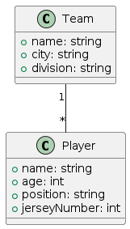
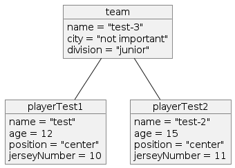

How to define and evaluate constraints
=======================================

First Step: Defining a domain Model
########################################
In the first step, we need a domain model. let take an example of simple team-player domain model containing a team and player class as shown in figure below:

The corresponding BUML code for defining the classes and association is shown below:

.. code-block:: python

    # Primitive DataTypes
    t_int: PrimitiveDataType = PrimitiveDataType("int")
    t_str: PrimitiveDataType = PrimitiveDataType("str")
    t_date: PrimitiveDataType = PrimitiveDataType("date")

    # Team attributes definition
    team_name: Property = Property(name="name", type=t_str)
    team_city: Property = Property(name="city", type=t_str)
    team_division: Property = Property(name="division", type=t_str)
    # Team class definition
    team: Class = Class (name="team", attributes={team_name,team_city,team_division})

    # Player attributes definition
    name: Property = Property(name="name", type=t_str)
    age: Property = Property(name="age", type=t_int)
    position: Property = Property(name="position", type=t_str)
    jerseyNumber: Property = Property(name="jerseyNumber", type=t_int)

    # Player class definition
    player: Class = Class (name="player", attributes={name, age, position,jerseyNumber})

    # team-player association definition
    hasteam: Property = Property(name="many",type=team, multiplicity=Multiplicity(1, 1))
    many: Property = Property(name="has", type=player, multiplicity=Multiplicity(0, "*"))
    team_player_association: BinaryAssociation = BinaryAssociation(name="team_player_asso", ends={hasteam, many})

Now, lets define some OCL constraints, lets begin with a simple one that the age should be greater than 10.

.. code-block:: python

    context player inv inv1: self.age > 10

and the corresponding BUML code is:

.. code-block:: python

    constraintPlayerAge: Constraint = Constraint(name = "playerAge",context=player,expression="context player inv inv1: self.age > 10",language="OCL")

Similarly, lets have a constraint where less than three players can play center:

.. code-block:: python

    context team inv inv2: self.many -> collect(p:player| p.position = 'center')->size()<3

and the corresponding code BUML is:

.. code-block:: python

    constraintTeamCenter: Constraint = Constraint(name = "teamCenter",context=team,expression="context team inv inv2: self.many -> collect(p:player| p.position = 'center')->size()<3",language="OCL")

Lets combine all this into a domain model with the code

.. code-block:: python

    team_player_model : DomainModel = DomainModel(name="Team-Player model", types={team,player},
                                          associations={team_player_association },
                                          constraints={
                                          constraintPlayerAge,
                                          constraintTeamCenter
                                          })

Second Step: Defining a object Model
#####################################

In the second step, we need to define an object model for these constraints to be validated on. Now, lets create the objects for our team-player domain model as shown in figure below:

and its corresponding BUML code:

.. code-block:: python

    # Team object attributes
    teamObjectName: AttributeLink = AttributeLink(attribute=team_name, value=DataValue(classifier=t_str, value="test-3"))
    teamcity: AttributeLink = AttributeLink(attribute=team_city, value=DataValue(classifier=t_str, value="not important"))
    teamDivision: AttributeLink = AttributeLink(attribute=team_division, value=DataValue(classifier=t_str, value="junior"))
    # Team object
    teamObject: Object = Object(name="team object", classifier=team, slots=[teamObjectName,teamcity,teamDivision])

    # player object attributes
    player1_obj_name: AttributeLink = AttributeLink(attribute=name, value=DataValue(classifier=t_str, value="test"))
    player1_obj_age: AttributeLink = AttributeLink(attribute=age, value=DataValue(classifier=t_int, value=12))
    player1_obj_position: AttributeLink = AttributeLink(attribute=position, value=DataValue(classifier=t_str, value="center"))
    player1_obj_JN: AttributeLink = AttributeLink(attribute=jerseyNumber, value=DataValue(classifier=t_int, value=10))

    # Player object
    player_1_obj: Object = Object(name="playerTest1", classifier=player, slots=[player1_obj_name, player1_obj_age,player1_obj_position,player1_obj_JN])

    # player 2 object attributes
    player2_obj_name: AttributeLink = AttributeLink(attribute=name, value=DataValue(classifier=t_str, value="test-2"))
    player2_obj_age: AttributeLink = AttributeLink(attribute=age, value=DataValue(classifier=t_int, value=15))
    player2_obj_position: AttributeLink = AttributeLink(attribute=position, value=DataValue(classifier=t_str, value="center"))
    player2_obj_JN: AttributeLink = AttributeLink(attribute=jerseyNumber, value=DataValue(classifier=t_int, value=11))

    # Player object
    player_2_obj: Object = Object(name="playerTest2", classifier=player, slots=[player2_obj_name, player2_obj_age,player2_obj_position,player2_obj_JN])

    # player1 team object link
    player_1_link_end: LinkEnd = LinkEnd(name="many", association_end=hasteam, object=player_1_obj)
    team_1_link_end: LinkEnd = LinkEnd(name="has", association_end=many, object=teamObject)
    team_player_link_1: Link = Link(name="team_player_link_1", association=team_player_association, connections=[player_1_link_end,team_1_link_end])

    # player2 team object link
    player_2_link_end: LinkEnd = LinkEnd(name="many", association_end=hasteam, object=player_2_obj)
    team_2_link_end: LinkEnd = LinkEnd(name="has", association_end=many, object=teamObject)
    team_player_link_2: Link = Link(name="team_player_link_2", association=team_player_association, connections=[player_2_link_end,team_2_link_end])

    # Object model definition
    object_model: ObjectModel = ObjectModel(name="Object model", instances={teamObject, player_1_obj,player_2_obj}, links={team_player_link_1,team_player_link_2})

Third Step: Evaluating the constraint
#####################################

For the third step we will define a test case that will iteratively parse the constraints and interpret them based on the values of object model.
Here is the python code

.. code-block:: python

    from models.team_player_object import team_player_model as domain_model,object_model
    from bocl.OCLWrapper import OCLWrapper

    if __name__ == "__main__":
        wrapper = OCLWrapper(domain_model, object_model)
        for constraint in domain_model.constraints:
            print("Query: " + str(constraint.expression), end=": ")
            res = None
            try:
                res = wrapper.evaluate(constraint)
                print('\x1b[0;30;35m' + str(res) + '\x1b[0m')

            except Exception as error:
                print('\x1b[0;30;41m' + 'Exception Occured! Info:' + str(error) + '\x1b[0m')
                res = None

and the output for this code will be:

.. code-block:: python

    Query: context team inv inv2: self.many -> collect(p:player| p.position = 'center')->size()<3: True
    Query: context player inv inv1: self.age > 10: True

The complete code is available on our github repository https://github.com/BESSER-PEARL/BOCL-Interpreter.
