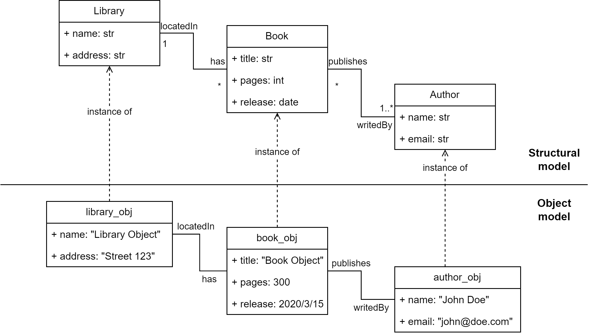

Library Model (Structural and Object) example
====================

This image below shows the structural model and object model of Library

Some of the OCL Constraints defined on these models are shown below:

.. code-block:: python

    context Book inv inv2: self.pages>0

    context Library inv inv3: if self.name <> 'NI' then self.has->exists"
           "( i_book : Book | i_book.pages <= 110 ) else self.has->forAll(b:Book|b.pages>0)"
           " endif

Some example constraints are defined in the `Library  example <https://github.com/BESSER-PEARL/b-ocl-Interpreter/blob/5db7fd0e1f0f4e98569164fbd4d815baf5e45d17/models/library_object.py#L45-L80/>`_

More constrained can be defined using BUML Structural and rules classes as shown below:

.. code-block:: python

    constraintLibraryElse: Constraint = Constraint(name ="LibaryElse", context=library,
            expression="context Library inv inv3: if self.name = 'NI' then self.has->exists"
           "( i_book : Book | i_book.pages <= 110 ) else self.has->forAll(b:Book|b.pages>0)"
           " endif", language="OCL")
