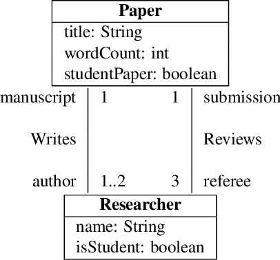

Researcher-Paper Model (Structural and Object)
================================

This image below shows the structural model of Researcher Paper Review taken from the paper `Verification of UML/OCL Class Diagrams using
Constraint Programming`

Some of the OCL Constraints defined on these models are shown below:

.. code-block:: python

    context Paper inv LimitsOnStudentPapers: Paper::allInstances()->exists(p | p.studentPaper) and Paper::allInstances()->select(p | p.studentPaper)->size() < 5

    context Paper inv :self.wordCount < 10000

Some example constraints are defined in the /models/researcher_object

More constrained can be defined using BUML Structural and rules classes as shown below:

.. code-block:: python

    constraintNoStudentReviewers: Constraint = Constraint(name="NoStudentReviewers", context=paper,
                                               expression="context Paper inv NoStudentReviewers:self.referee->forAll(r | not r.isStudent)", language="OCL")

