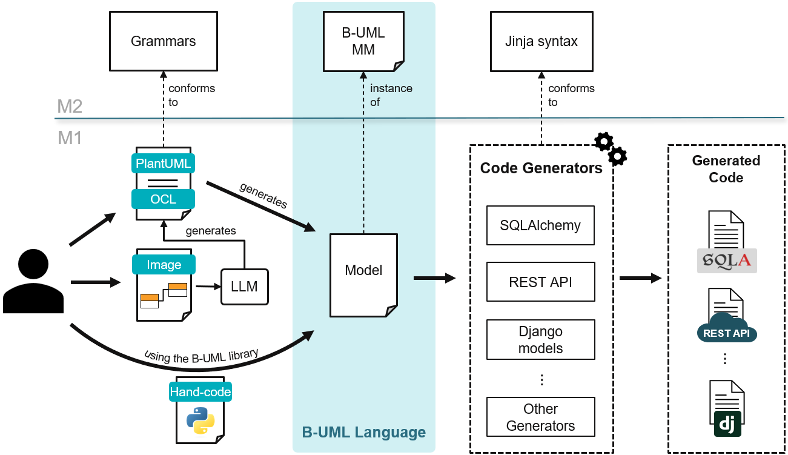
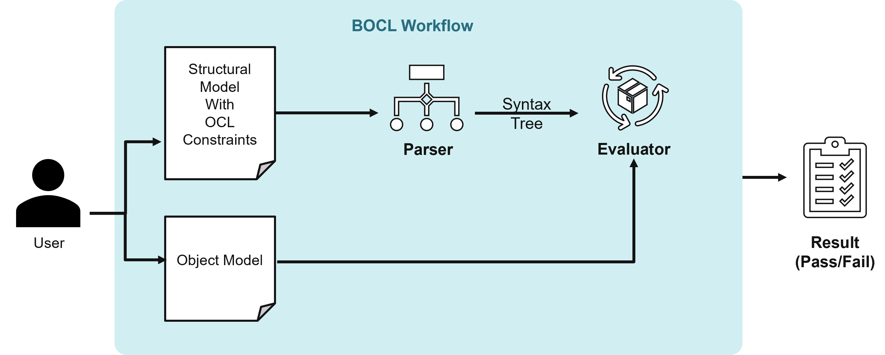

Welcome to BESSER's Object Constraint Language (BOCL) interpreter Documentation
=================================

**BOCL** is a tool designed to parse and evaluate the OCL constraints designed on **BESSER** models.
It is a python based implementation, that utilises parser and listener generated with the ANTLR4 grammer.

**BESSER** is a `low-modeling <https://modeling-languages.com/welcome-to-the-low-modeling-revolution/>`_
`low-code <https://modeling-languages.com/low-code-vs-model-driven/>`_ open-source platform built on top 
of our Python-based personal interpretation of a "Universal Modeling Language"

.. note::
   BESSER and BOCL are funded thanks to an `FNR Pearl grant <https://modeling-languages.com/a-smart-low-code-platform-for-smart-software-in-luxembourg-goodbye-barcelona/>`_
   led by the `Luxembourg Institute of Science and Technology <https://www.list.lu/>`_ with the participation 
   of the `Snt/University of Luxembourg <https://www.uni.lu/snt-en/>`_ and open to all your contributions!

Figure below show the workflow for BOCL Interpreter. For more details on defining and evaluating OCL constraints please look at examples/How to define and evaluate constraints

.. note::
    Kindly note that with boolean attribute the expected value (True/False) much be added in the constraint. BOCL does not support default value (i.e., True) for boolean attributes.
    Also note that for LoopExpressions it is important to mention the type of iterator.

Contents
--------

.. toctree::
   :maxdepth: 2

   installation
   examples
   api
   releases
   contributing
   about